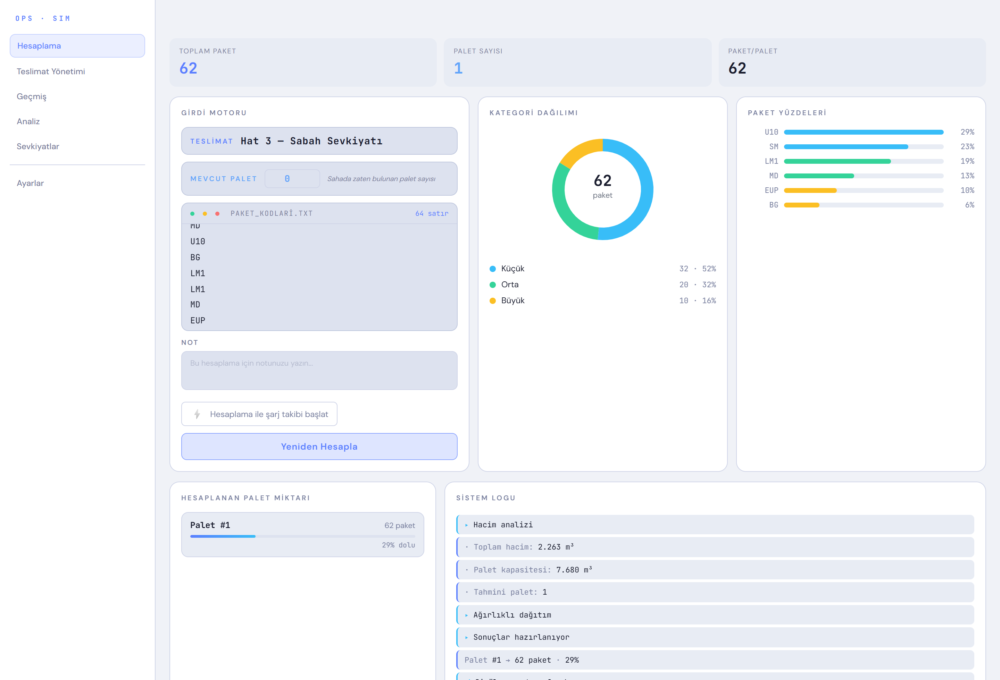
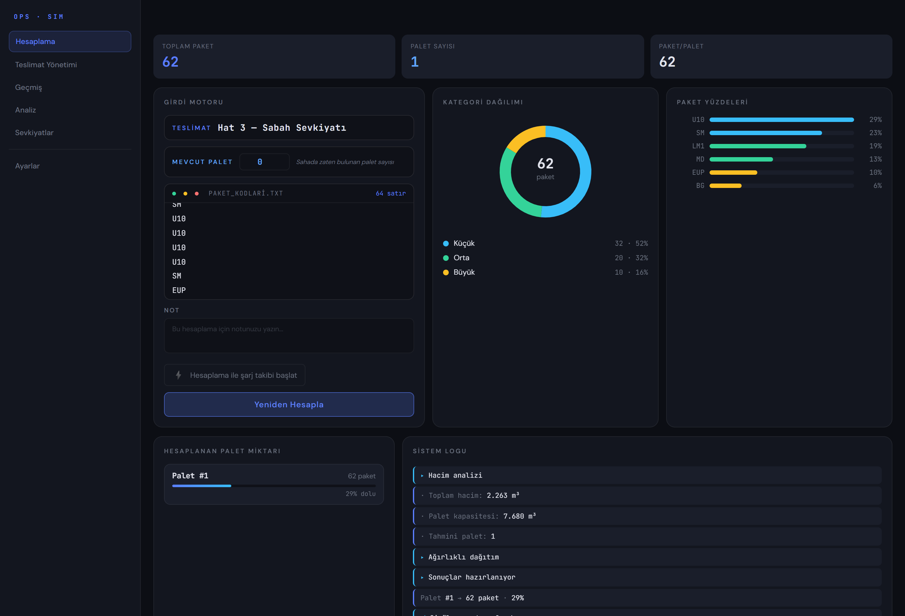
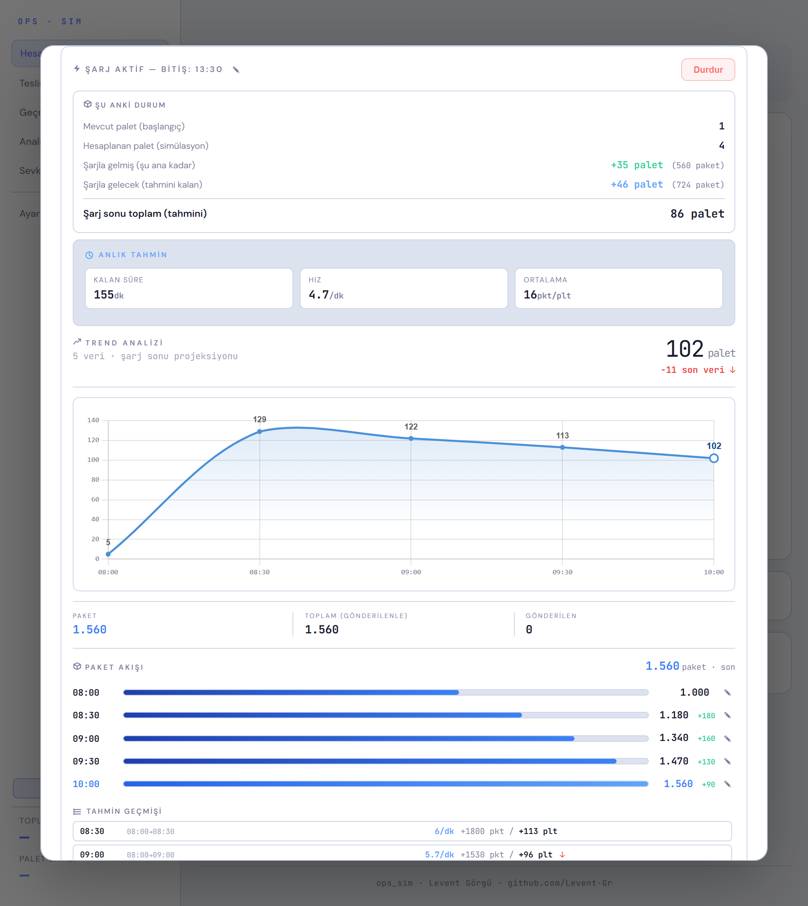
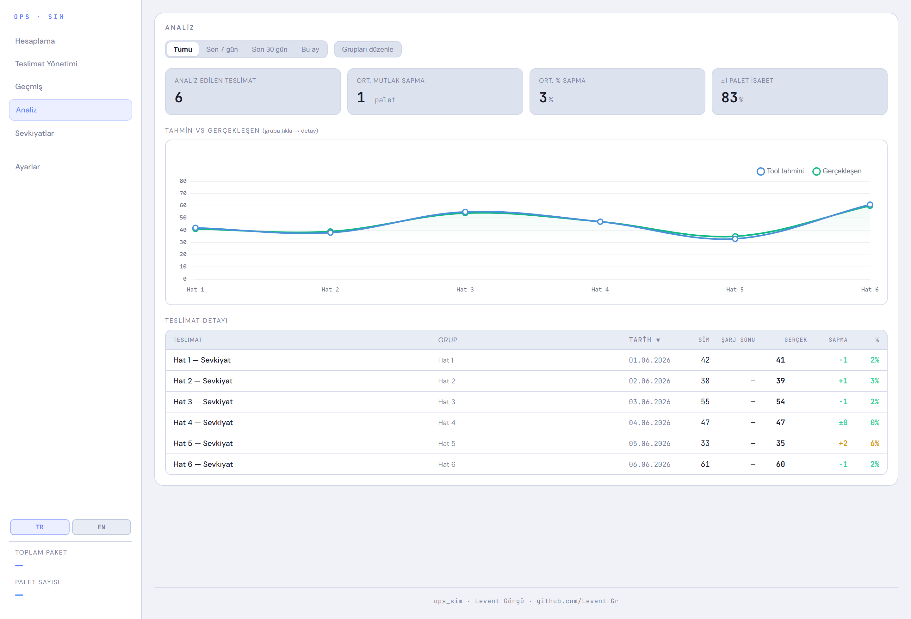

<div align="center">

# ⚡ OPS · SIM

**Akıllı paket → palet simülasyonu ve canlı teslimat tahmin aracı**
**Smart package‑to‑pallet simulation & live delivery forecasting**


</div>

> **TR —** Sahadaki paket akışından, teslimat saatinde kaç palete ulaşılacağını **iki bağımsız yöntemle** önceden tahmin eder: bir **paketleme simülasyonu** ve **canlı şarj takibi**. Tamamen tarayıcıda çalışır — backend yok, kullanıcı hesabı yok, tüm veriler cihazda kalır.
>
> **EN —** Predicts how many pallets a delivery will reach by its deadline using **two independent methods**: a **packing simulation** and **live "charge" tracking**. Runs entirely in the browser — no backend, no account, all data stays on the device.

<p align="center">
  
</p>

---

## ✨ Öne Çıkanlar · Highlights

- 📦 **Simülasyon · Simulation** — Ham paket kodlarından ağırlıklı yerleştirme algoritmasıyla palet sayısı, doluluk ve kategori dağılımı. <br/> _Weighted bin‑packing from raw package codes → pallet count, fill rate & category breakdown._
- ⚡ **Canlı Şarj Takibi · Live Charge Tracking** — Gün içi sayımlardan bitiş saatine projeksiyon: anlık hız, kalan süre ve şarj‑sonu palet tahmini; otomatik durdurma. <br/> _Projects end‑of‑shift pallets from periodic counts — live rate, ETA and forecast, with auto‑stop._
- 📊 **Doğruluk Analizi · Accuracy Analytics** — Tahmin vs gerçekleşen; ortalama sapma (MAE), % hata ve **±1 palet isabet oranı**, grup bazlı trend. <br/> _Forecast vs actual with MAE, % error and a **±1‑pallet hit rate**, grouped trends._
- 🗂️ **Teslimat & Sevkiyat · Delivery & Shipment** — Sürükle‑bırak organizasyon, hatlara/sevkiyatlara gruplama, not ve arşivleme. <br/> _Drag‑and‑drop organize, group into lines/shipments, annotate and archive._
- 🌗 **Tema & Çift Dil · Theme & i18n** — Açık/koyu tema ve tam **TR/EN** arayüz. <br/> _Light/dark themes and full **TR/EN** UI._
- 🔒 **Yerel & Gizli · Local‑first & Private** — Veriler **IndexedDB**'de saklanır, sunucuya hiçbir şey gönderilmez; tek tıkla JSON yedekleme. <br/> _Data lives in **IndexedDB**, nothing ever leaves the device; one‑click JSON backup._

---

## 📸 Ekran Görüntüleri · Screenshots

**Simülasyon panosu — Açık & Koyu tema** · _Simulation dashboard — Light & Dark_

<table>
  <tr>
    <td width="50%"></td>
    <td width="50%"></td>
  </tr>
</table>

**⚡ Canlı şarj tahmini — durum dökümü, anlık tahmin ve trend projeksiyonu** · _Live charge forecast — status breakdown, instant forecast & trend projection_

<p align="center">
  
</p>

**📊 Doğruluk analizi — tahmin vs gerçekleşen** · _Accuracy analytics — forecast vs actual_

<p align="center">
  
</p>

---

## 🛠 Teknoloji · Tech Stack

**Vanilla JavaScript (ES modules)** · **Vite** · **Chart.js** · **IndexedDB**

Çerçevesiz, backend'siz, çevrimdışı çalışan tek sayfa uygulaması; çalışma zamanında tek bağımlılık **Chart.js**.
_A framework‑free, backend‑free, offline‑capable single‑page app; the only runtime dependency is **Chart.js**._

---

## 🧱 Mimari · Architecture

Modüller `src/` kökünde düz `.js` dosyalarıdır. Durum, alana göre ayrılmış store'larda tutulur; `state.js` bunları tek noktadan re-export eden bir barrel'dır.
_Modules are flat `.js` files under `src/`. State lives in domain‑separated stores; `state.js` is a barrel re‑exporting them._

```
src/
├── main.js              # Giriş noktası · entry point
├── state.js             # Barrel: store + sabitler · stores + constants
├── stores/              # Alan‑bazlı durum · domain state (config, delivery, grup, charge, history, ui)
├── sim.js               # Simülasyon motoru · packing engine + charts
├── charge.js            # Canlı şarj/forecast · live charge & forecast (Chart.js)
├── delivery.js · grup.js · history.js · stats.js   # Sekmeler · tabs
├── config.js · io.js · db.js                        # Konfig · yedek · IndexedDB
├── i18n.js · theme.js · dialog.js · icons.js · utils.js
└── styles/              # CSS — base, layout, components/
```

---

## 👤 Yazar · Author

**Levent Görgü** — [github.com/Levent-Gr](https://github.com/Levent-Gr)

Bu proje Levent Görgü tarafından tasarlanıp geliştirilmiştir. _Designed & built by Levent Görgü._

## 📄 Lisans · License

MIT © 2026 Levent Görgü
